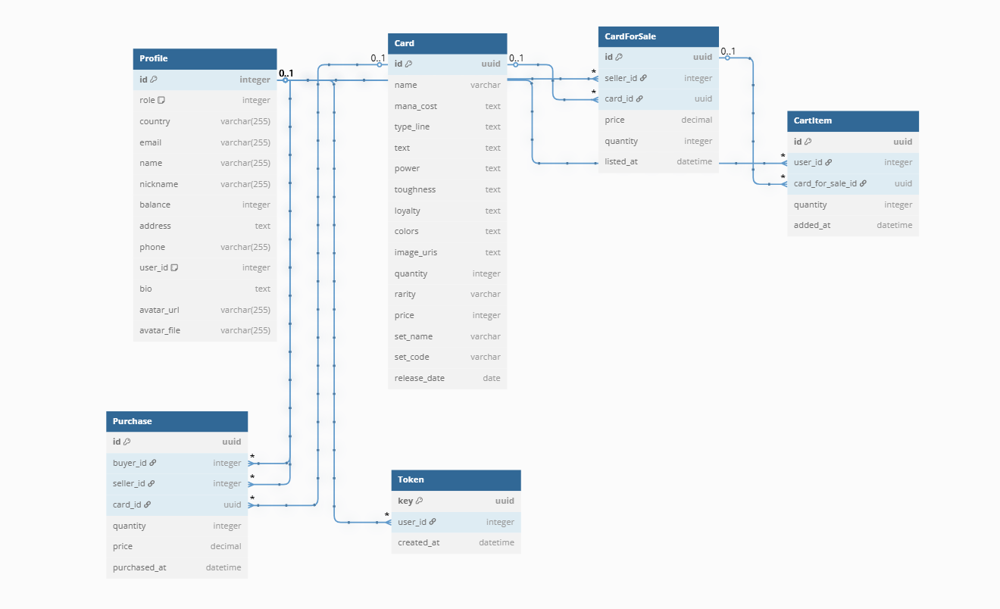

# Cardmarket2

**Introducción al proyecto CardShop**

CardShop es una plataforma web desarrollada con Django cuyo objetivo es facilitar la compraventa de cartas coleccionables (por ejemplo, cartas de juegos de rol o de intercambio tipo “Magic: The Gathering”). A través de CardShop, los usuarios pueden:

- **Crear y gestionar catálogos de cartas**: cada carta dispone de sus atributos (nombre, coste de maná, rareza, precio, etc.).
- **Ofrecer cartas en venta**: un usuario puede listar una o varias copias de una carta a un precio determinado.
- **Comprar cartas**: los usuarios añaden al carrito las cartas que desean adquirir y, tras confirmar, quedan registradas sus compras.
- **Intercambiar mensajes**: dispone de un sistema de chat para que comprador y vendedor puedan comunicarse.
- **Gestionar perfiles y roles**: diferenciar usuarios normales, moderadores o administradores, con datos de contacto, saldo, avatar y biografía.
- **Mantener historial de transacciones**: registros de ventas y compras asociados a cada perfil, con fecha y cantidad.

Esta arquitectura modular atiende tanto a la gestión de inventarios como a la experiencia de compraventa y comunicación entre usuarios, asegurando trazabilidad de cada operación y flexibilidad para futuros módulos (p. ej. valoraciones, subastas, categorías de cartas).

---

# Backend

## `models.py`

### Modelo `Card`

Representa una carta en el catálogo global.

| Campo          | Tipo                        | Descripción                                                      |
| -------------- | --------------------------- | ---------------------------------------------------------------- |
| `id`           | `UUIDField`                 | Identificador único (clave primaria).                            |
| `name`         | `CharField(max_length=255)` | Nombre de la carta.                                              |
| `mana_cost`    | `TextField`                 | Coste de maná (puede incluir símbolos o texto extenso).          |
| `type_line`    | `TextField`                 | Línea de tipo (criatura, conjuro, etc.).                         |
| `text`         | `TextField`                 | Texto de reglas o habilidades.                                   |
| `power`        | `TextField`                 | Fortaleza (para criaturas).                                      |
| `toughness`    | `TextField`                 | Resistencia (para criaturas).                                    |
| `loyalty`      | `TextField`                 | Lealtad (para planeswalkers).                                    |
| `colors`       | `TextField`                 | Colores asociados (lista serializada).                           |
| `image_uris`   | `TextField`                 | URLs de las imágenes (una o varias).                             |
| `quantity`     | `IntegerField`              | Cantidad disponible en el inventario general (para uso interno). |
| `rarity`       | `CharField(max_length=20)`  | Rareza (común, infrecuente, rara, mítica).                       |
| `price`        | `IntegerField`              | Precio base sugerido (en la moneda de la plataforma).            |
| `set_name`     | `CharField(max_length=100)` | Nombre del set o colección.                                      |
| `set_code`     | `CharField(max_length=10)`  | Código del set (opcional).                                       |
| `release_date` | `DateField`                 | Fecha de salida del set (opcional).                              |

**Métodos**

- `__str__()`: devuelve el nombre de la carta.

---

### Modelo `Profile`

Perfil de usuario extendido, enlazado a `AUTH_USER_MODEL`. Incluye datos de contacto, rol y estado de cuenta.

| Campo         | Tipo                                  | Descripción                                             |
| ------------- | ------------------------------------- | ------------------------------------------------------- |
| `role`        | `PositiveSmallIntegerField` (choices) | Rol dentro de la plataforma: Usuario, Moderador, Admin. |
| `country`     | `CharField(max_length=255)`           | País de residencia.                                     |
| `email`       | `CharField(max_length=255)`           | Correo electrónico.                                     |
| `name`        | `CharField(max_length=255)`           | Nombre completo.                                        |
| `nickname`    | `CharField(max_length=255)`           | Apodo dentro de la comunidad.                           |
| `balance`     | `IntegerField`                        | Saldo disponible para compras.                          |
| `address`     | `TextField`                           | Dirección postal.                                       |
| `phone`       | `CharField(max_length=255)`           | Teléfono de contacto.                                   |
| `user`        | `OneToOneField` → `AUTH_USER_MODEL`   | Relación uno-a-uno con el usuario de Django.            |
| `bio`         | `TextField`                           | Biografía o descripción personal (opcional).            |
| `avatar_url`  | `URLField`                            | URL de avatar remoto (opcional).                        |
| `avatar_file` | `ImageField(upload_to='avatars/')`    | Avatar subido por el usuario (opcional).                |

**Choices internas**

- `Role.USER = 1`
- `Role.MODERATOR = 2`
- `Role.ADMIN = 3`

**Métodos**

- `__str__()`: devuelve el nombre de usuario (`user.username`).

---

### Modelo `CardForSale`

Listado específico de cartas que un usuario ofrece en venta.

| Campo       | Tipo                               | Descripción                                       |
| ----------- | ---------------------------------- | ------------------------------------------------- |
| `id`        | `UUIDField`                        | Identificador único.                              |
| `seller`    | `ForeignKey(Profile)`              | Perfil del vendedor.                              |
| `card`      | `ForeignKey(Card)`                 | Carta que se ofrece.                              |
| `price`     | `DecimalField`                     | Precio por unidad (hasta 6 dígitos, 2 decimales). |
| `quantity`  | `PositiveIntegerField`             | Número de copias que vende (por defecto 1).       |
| `listed_at` | `DateTimeField(auto_now_add=True)` | Fecha/hora de publicación automática.             |

---

### Modelo `CartItem`

Elemento del carrito de compras de un usuario.

| Campo           | Tipo                               | Descripción                               |
| --------------- | ---------------------------------- | ----------------------------------------- |
| `id`            | `UUIDField`                        | Identificador único.                      |
| `user`          | `ForeignKey(Profile)`              | Perfil que incluye el ítem en su carrito. |
| `card_for_sale` | `ForeignKey(CardForSale)`          | Referencia al listado de venta.           |
| `quantity`      | `PositiveIntegerField`             | Copias deseadas.                          |
| `added_at`      | `DateTimeField(auto_now_add=True)` | Fecha/hora de adición.                    |

---

### Modelo `Purchase`

Registro de una compra concreta.

| Campo          | Tipo                               | Descripción                                  |
| -------------- | ---------------------------------- | -------------------------------------------- |
| `id`           | `UUIDField`                        | Identificador único.                         |
| `buyer`        | `ForeignKey(Profile)`              | Perfil comprador.                            |
| `card`         | `ForeignKey(Card)`                 | Carta adquirida.                             |
| `seller`       | `ForeignKey(Profile)`              | Perfil vendedor; si se borra, pasa a `null`. |
| `quantity`     | `PositiveIntegerField`             | Número de copias compradas.                  |
| `price`        | `DecimalField`                     | Precio unitario pagado.                      |
| `purchased_at` | `DateTimeField(auto_now_add=True)` | Fecha/hora de la transacción.                |

---

### Modelo `Token`

Clave de autenticación o sesión para API.

| Campo        | Tipo                               | Descripción                    |
| ------------ | ---------------------------------- | ------------------------------ |
| `user`       | `ForeignKey(User)`                 | Usuario propietario del token. |
| `key`        | `UUIDField`                        | Token único (clave primaria).  |
| `created_at` | `DateTimeField(auto_now_add=True)` | Fecha de generación.           |

---

## Modelos



# `urls.py`

## Descripción de rutas

| URL                                    | Vista                         | Nombre                        | Método HTTP      | Descripción                                                     |
| -------------------------------------- | ----------------------------- | ----------------------------- | ---------------- | --------------------------------------------------------------- |
| `/cards/`                              | `card_list`                   | `card-list`                   | GET              | Lista cartas básicas.                                           |
| `/cards/random/`                       | `random_cards`                | `random-cards`                | GET              | Devuelve un conjunto aleatorio de cartas con stock.             |
| `/cards/all/`                          | `all_cards`                   | `all-cards`                   | GET              | Listado paginado y filtrable de todas las cartas.               |
| `/card/<slug>/`                        | `card_detail`                 | `card-detail`                 | GET              | Detalle de carta usando su slug.                                |
| `/cards/<uuid:card_id>/`               | `card_detail`                 | `card-detail`                 | GET              | Detalle de carta usando su UUID.                                |
| `/cards/edit/`                         | `edit_card`                   | `edit-card`                   | PUT              | Actualiza datos de una carta existente.                         |
| `/cards/delete/`                       | `delete_card`                 | `delete-card`                 | DELETE           | Elimina una carta del sistema.                                  |
| `/users/login/`                        | `user_login`                  | `user-login`                  | POST             | Autentica usuario y genera token.                               |
| `/users/signup/`                       | `user_signup`                 | `user-signup`                 | POST             | Registro de nuevo usuario.                                      |
| `/users/edit/`                         | `edit_profile`                | `edit-profile`                | PUT / PATCH      | Modifica datos y avatar de perfil.                              |
| `/users/check-token/`                  | `check_token`                 | `check-token`                 | GET              | Verifica validez de token.                                      |
| `/users/debug-token/`                  | `debug_token`                 | `debug-token`                 | GET              | Muestra detalles del token para depuración.                     |
| `/users/delete/`                       | `delete_account`              | `delete-account`              | DELETE           | Elimina cuenta y perfil.                                        |
| `/seller/<username>/profile/`          | `seller_profile`              | `seller_profile`              | GET              | Perfil público de un vendedor.                                  |
| `/users/sell/`                         | `sell_card`                   | `sell-card`                   | POST             | Publica carta para la venta.                                    |
| `/users/all-card-sale-for-user/`       | `all_card_sale_for_user`      | `all-card-sale-for-user`      | GET              | Todas las cartas puestas a la venta por el usuario autenticado. |
| `/users/my-cards-for-sale/`            | `my_cards_for_sale`           | `my-cards-for-sale`           | GET              | Mis cartas actualmente en venta.                                |
| `/users/my-cards-for-sale/<pk>/`       | `card_for_sale_detail`        | `card_for_sale_detail`        | GET, PUT, DELETE | Ver/editar/eliminar una oferta de venta por su ID.              |
| `/users/my-cards-for-sale/<sale_id>/`  | `delete_card_for_sale`        | `delete-card-for-sale`        | DELETE           | Elimina una oferta de venta por UUID.                           |
| `/users/all-cards-sold-by-user/`       | `all_cards_sold_by_user`      | `all-cards-sold-by-user`      | GET              | Historial de cartas vendidas por el usuario.                    |
| `/users/my-sold-cards/`                | `my_sold_cards`               | `my_sold_cards`               | GET              | Mis transacciones de venta.                                     |
| `/users/all-card-purchased-for-user/`  | `all_card_purchased_for_user` | `all-card-purchased-for-user` | GET              | Todas las compras realizadas por el usuario.                    |
| `/users/cart/`                         | `user_cart`                   | `user_cart`                   | GET              | Vista del contenido actual del carrito.                         |
| `/users/cart/add/`                     | `add_cart`                    | `add-cart`                    | POST             | Añade o actualiza ítem en el carrito.                           |
| `/users/cart/delete/`                  | `delete_cart`                 | `delete-cart`                 | DELETE           | Elimina un ítem específico del carrito.                         |
| `/users/cart/delete/all/`              | `delete_all_cart_items`       | `delete-all-cart-items`       | DELETE           | Vacia todo el carrito.                                          |
| `/users/cart/delete/delete-cart-sold/` | `delete_cart_sold`            | `delete-cart-sold`            | DELETE           | Elimina ítems ya vendidos del carrito.                          |
| `/cart/<pk>/`                          | `cart_item_detail`            | `cart_item_detail`            | GET, PUT, DELETE | Operaciones CRUD en un ítem de carrito por su ID.               |
| `/users/cart/buy-for-card/`            | `buy_for_card`                | `buy-for-card`                | POST             | Realiza compra con datos de tarjeta.                            |
| `/users/cart/buy-for-wallet/`          | `buy_for_wallet`              | `buy-for-wallet`              | POST             | Realiza compra usando saldo interno (wallet).                   |
| `/users/wallet/`                       | `wallet_balance`              | `wallet-balance`              | GET              | Consulta saldo de la billetera.                                 |
| `/cards/expansions/`                   | `list_expansions`             | `list-expansions`             | GET              | Listado de expansiones disponibles.                             |
| `/cards/expansion/<code>/`             | `cards_by_expansion`          | `cards-by-expansion`          | GET              | Filtra cartas por código de expansión.                          |

---

## `views.py`

### Funciones de utilidad

#### `send_email(destinatario)`

Envía un correo de agradecimiento a un comprador.

- **Parámetros**:

  - `destinatario` (_str_): Dirección de correo electrónico del destinatario.

- **Comportamiento**: Construye un mensaje de correo y lo envía mediante SMTP de Gmail usando credenciales obtenidas de variables de entorno.
- **Excepciones**: Captura y registra errores durante la transacción SMTP.

#### `validate_email_unique(email)`

Verifica si un correo electrónico ya está registrado.

- **Parámetros**:

  - `email` (_str_): Dirección de correo electrónico a validar.

- **Retorno**: `False` si ya existe un usuario con ese correo; en caso contrario, `True`.

#### `validate_username_unique(username)`

Verifica si un nombre de usuario ya está registrado.

- **Parámetros**:

  - `username` (_str_): Nombre de usuario a validar.

- **Retorno**: `False` si ya existe un usuario con ese nombre; en caso contrario, `True`.

#### `logic_buyers(sale, buyer)`

Sincroniza las cantidades en el carrito de otros compradores cuando cambia el stock.

- **Parámetros**:

  - `sale` (_CardForSale_): Instancia de venta cuyo stock ha cambiado.
  - `buyer` (_Profile_): Perfil del comprador que originó el cambio.

- **Comportamiento**: Itera sobre otros compradores y ajusta la cantidad de sus artículos en el carrito si el stock ha aumentado.

### Vistas de recuperación de cartas

#### `random_cards(request)`

Devuelve una selección aleatoria de cartas disponibles para la venta.

- **Método**: `GET`
- **Autenticación**: Ninguna
- **Parámetros de consulta**:

  - `count` (opcional, por defecto `4`): Número de cartas a recuperar.

- **Respuesta**: Objeto JSON con `cards` (lista) y `total` (int).

#### `card_list(request)`

Devuelve todas las cartas de la base de datos serializadas vía `CardSerializer`.

- **Método**: `GET`
- **Autenticación**: Ninguna
- **Respuesta**: Lista JSON con los datos de las cartas.

#### `all_cards(request)`

Listado paginado de todas las cartas con vendedores activos.

- **Método**: `GET`
- **Parámetros de consulta**:

  - `number-start` (_int_, número de página, por defecto `1`)
  - `search` (_string_, filtra por nombre)
  - `sort` (`name`, `price`, `price_desc`)

- **Respuesta**: JSON con `cards` (lista) y `total` (int).

#### `cards_by_expansion(request, code)`

Listado paginado de cartas filtradas por código de expansión.

- **Método**: `GET`
- **Parámetros de ruta**:

  - `code` (_str_): Código de expansión.

- **Parámetros de consulta**: Mismos que en `all_cards`.
- **Respuesta**: JSON con `cards` y `total`.

#### `list_expansions(request)`

Lista todas las expansiones distintas.

- **Método**: `GET`
- **Respuesta**: JSON con `expansions` (lista de `{set_name, set_code}`).

#### `card_detail(request, card_id)`

Obtiene detalles de una carta y sus vendedores.

- **Método**: `GET`
- **Parámetros de ruta**:

  - `card_id` (_int_): ID de la carta.

- **Respuesta**: JSON con los campos de la carta y una lista de vendedores.

### Vistas de autenticación

#### `user_login(request)`

Autentica a un usuario y emite un token.

- **Método**: `POST`
- **Cuerpo**: JSON con `username` y `password`.
- **Respuesta**: JSON `{token}` o error.

#### `user_signup(request)`

Registra un nuevo usuario y crea su perfil.

- **Método**: `POST`
- **Cuerpo**: JSON con `firstname`, `lastname`, `username`, `password`, `email` y opcional `nickname`.
- **Respuesta**: JSON `{token}` o error.

#### `check_token(request)`

Endpoint de depuración que devuelve cabeceras y cuerpo del token.

- **Método**: `GET` o `POST`
- **Autenticación**: Opcional
- **Respuesta**: JSON con eco de cabeceras y cuerpo.

### Vistas de perfil

#### `edit_profile(request)`

Recupera o actualiza el perfil del usuario autenticado.

- **Método**: `GET`, `POST`
- **Autenticación**: Requerida
- **GET Respuesta**: JSON con campos del perfil.
- **POST**:

  - Si es `multipart/form-data`, actualiza `avatar_file` y otros campos.
  - Si no, espera JSON con los campos a actualizar.

- **POST Respuesta**: Perfil actualizado en JSON.

#### `seller_profile(request, username)`

Recupera el perfil público y las cartas en venta de un vendedor.

- **Método**: `GET`
- **Parámetros de ruta**:

  - `username` (_str_)

- **Respuesta**: JSON con info de perfil y `cards_for_sale`.

### Vistas del carrito

#### `add_cart(request)`

Agrega cartas al carrito del usuario autenticado.

- **Método**: `POST`
- **Autenticación**: Requerida
- **Cuerpo**: JSON con `card-id`, `nickname` (vendedor) y `number-cards`.
- **Respuesta**: JSON con detalles del artículo en el carrito.

#### `delete_cart(request)`

Elimina un artículo específico del carrito.

- **Método**: `POST`
- **Autenticación**: Requerida
- **Cuerpo**: JSON con `cart` (ID del artículo).
- **Respuesta**: Mensaje de éxito o error.

#### `user_cart(request)`

Recupera todos los artículos del carrito del usuario.

- **Método**: `GET`
- **Autenticación**: Requerida
- **Respuesta**: JSON con la lista `cart`.

#### `cart_item_detail(request, pk)`

Actualiza o elimina un artículo del carrito.

- **Método**: `PATCH`, `DELETE`
- **Autenticación**: Requerida
- **Parámetros de ruta**: `pk` (ID del artículo)
- **PATCH Cuerpo**: JSON con `quantity`
- **Respuesta**: Cantidad actualizada o confirmación de eliminación.

#### `delete_all_cart_items(request)`

Vacía el carrito del usuario y restaura el stock.

- **Método**: `POST`
- **Autenticación**: Requerida
- **Respuesta**: Número de artículos eliminados.

### Vistas de compra y venta

#### `sell_card(request)`

Pone una carta a la venta.

- **Método**: `POST`
- **Autenticación**: Requerida
- **Cuerpo**: JSON con `card-id`, `price` y `quantity`.
- **Respuesta**: Mensaje de éxito.

#### `my_cards_for_sale(request)`

Obtiene o elimina tus propias ofertas.

- **Método**: `GET`, `POST`
- **Autenticación**: Requerida
- **POST Cuerpo**: JSON con `id` (ID de `CardForSale`) para eliminar.
- **Respuesta**: Listado o confirmación de eliminación.

#### `my_sold_cards(request)`

Recupera las cartas vendidas por el usuario.

- **Método**: `GET`
- **Autenticación**: Requerida
- **Respuesta**: JSON con `cards_sold`.

#### `card_for_sale_detail(request, pk)`

Actualiza o elimina una oferta de venta.

- **Método**: `PATCH`, `DELETE`
- **Autenticación**: Requerida
- **Parámetros de ruta**: `pk` (ID de la oferta)
- **PATCH Cuerpo**: JSON con `quantity` y/o `price`
- **Respuesta**: Campos actualizados o confirmación de eliminación.

#### `delete_cart_sold(request)`

Elimina explícitamente la oferta de un vendedor.

- **Método**: `POST`
- **Autenticación**: Requerida
- **Cuerpo**: JSON con `card-id` y `nickname`.
- **Respuesta**: Mensaje de éxito.

#### `buy_for_wallet(request)`

Compra todos los artículos del carrito usando el saldo de la billetera.

- **Método**: `POST`
- **Autenticación**: Requerida
- **Respuesta**: Total pagado y número de artículos.

#### `buy_for_card(request)`

Compra todos los artículos del carrito usando tarjeta de crédito.

- **Método**: `POST`
- **Autenticación**: Requerida
- **Cuerpo**: JSON con `card-number`, `exp-date` y `cvc`.
- **Respuesta**: Total pagado y número de artículos.

#### `all_card_sale_for_user(request)`

Lista todas las cartas que el usuario ha puesto a la venta.

- **Método**: `POST`
- **Autenticación**: Requerida
- **Respuesta**: JSON con la lista `cards`.

#### `all_cards_sold_by_user(request)`

Lista todas las cartas vendidas por el usuario (como vendedor).

- **Método**: `POST`
- **Autenticación**: Requerida
- **Respuesta**: JSON con `cards` incluyendo información del comprador.

#### `all_card_purchased_for_user(request)`

Lista todas las cartas compradas por el usuario (como comprador).

- **Método**: `POST`
- **Autenticación**: Requerida
- **Respuesta**: JSON con `cards` incluyendo información del vendedor.

### Wallet y cuenta

#### `wallet_balance(request)`

Obtiene el saldo de la billetera del usuario autenticado.

- **Método**: `GET`
- **Autenticación**: Requerida
- **Respuesta**: JSON `{balance}`.

#### `delete_account(request)`

Elimina la cuenta y perfil del usuario autenticado.

- **Método**: `POST`
- **Autenticación**: Requerida
- **Respuesta**: Mensaje de éxito.

---

## `card_serializers.py`

### `CardSerializer`

Serializador para instancias del modelo `Card`, extiende `BaseSerializer`.

- **Constructor**:

  - `to_serialize`: Instancia única o iterable de objetos `Card`.
  - `fields` (opcional): Lista de campos a incluir.
  - `request`: Objeto `HttpRequest` de Django para construcción de URLs.

- **Métodos**:

  - `serialize_instance(instance) -> dict`: Devuelve un diccionario con atributos de la carta:

    - `id`, `name`, `mana_cost`, `type_line`, `text`, `power`, `toughness`, `loyalty`,
      `colors`, `image_uris`, `quantity`, `rarity`, `price`, `set_name`, `set_code`, `release_date`.

---

## `decorators.py`

### `require_get(view_func)`

Garantiza que la vista solo acepte solicitudes GET. Devuelve 405 en caso contrario.

### `require_post(view_func)`

Garantiza que la vista solo acepte solicitudes POST. Devuelve 405 en caso contrario.

### `method_required(method)`

Fábrica de decoradores para exigir un método HTTP específico.

### `validate_json(required_fields)`

Parsea el cuerpo JSON de solicitudes POST y lo asigna a `request.json_data`. Valida la presencia de `required_fields`.

### `auth_required(view_func)`

Autentica solicitudes mediante cabecera `Authorization` usando el modelo `Token`. Asigna `request.user` en caso de éxito.

---

## `serializers.py`

### `BaseSerializer`

Clase base abstracta para serializadores.

- **Constructor**:

  - `to_serialize`: Objeto o iterable a serializar.
  - `fields`: Lista opcional de nombres de campos a incluir.
  - `request`: Opcional `HttpRequest` para construcción de URLs.

- **Métodos**:

  - `build_url(path) -> str`: Construye URI absoluta si se proporcionó `request`.
  - `serialize_instance(instance) -> dict`: Abstracto, implementado por subclases.
  - `__serialize_instance(instance) -> dict`: Aplica filtrado de campos.
  - `serialize() -> dict | list[dict]`: Serializa objeto(s).
  - `to_json() -> str`: Cadena JSON de los datos serializados.
  - `json_response() -> JsonResponse`: Respuesta HTTP de Django con datos serializados.

---

## `admin.py`

Registra interfaces de administración de Django para los modelos:

- `CardAdmin`: Muestra `id`, `name`.
- `CartItemAdmin`: Muestra `id`, `user`, `card_for_sale`, `quantity`, `added_at`.
- `CardForSaleAdmin`: Muestra `id`, `card`, `seller`, `price`, `quantity`, `listed_at`; filtra por fecha, vendedor y carta; buscable por nombre de carta y alias del vendedor.
- `PurchaseAdmin`: Muestra `buyer`, `card`, `seller`, `quantity`, `price`, `purchased_at`.
- `ProfileAdmin`: Muestra campos de perfil y vista previa de avatar; filtra por `country`; buscable por nombre de usuario, alias y correo electrónico.
- `TokenAdmin`: Muestra `user`, `key`, `created_at`.

**Ayudante**:

- `avatar_preview(self, obj)`: Renderiza una etiqueta `` para el avatar en el administrador.

---

## `validator.py`

### `validate_card_data(card_number, exp_date, cvc)`

Valida información de tarjeta de crédito.

- **Parámetros**:

  - `card_number` (_str_): Número de tarjeta, puede incluir caracteres no numéricos.
  - `exp_date` (_str_): Fecha de expiración en formato `MM/YY` o `MM/YYYY`.
  - `cvc` (_str_): Código CVC (3 o 4 dígitos).

- **Pasos de validación**:

1. Elimina caracteres no numéricos de `card_number` y comprueba que tenga 16 dígitos.
2. Verifica que `cvc` tenga 3 o 4 dígitos.
3. Comprueba que `exp_date` cumpla el patrón y represente una fecha válida y no expirada.

- **Retorno**: `None` si es válida, de lo contrario un dict con `error`.

---

# Frontend

## `AboutUs.vue`

**Ubicación:** `src/components/AboutUs.vue`

### Descripción

Sección informativa "Sobre Nosotros" que presenta la misión de CardShop y ofrece enlaces rápidos a iniciar sesión o registrarse.

### API

- **Props:** Ninguna.
- **Emits:** Ninguno.
- **Slots:** Ninguno.

### Dependencias

- [vue-i18n](https://kazupon.github.io/vue-i18n/) para traducciones (`$t`, `$i18n.locale`).
- [vue-router](https://router.vuejs.org/) para navegación (`<router-link>`).

### Estado y lógica

No contiene estado propio ni lógica compleja. Se centra en la presentación de contenido traducible.

### Template

```html
<section class="aboutus-section" role="region" aria-labelledby="aboutus-title">
  <article class="aboutus-card">
    <h1 id="aboutus-title" class="aboutus-title">{{ $t('about.title') }}</h1>
    <div class="aboutus-text">
      <p v-html="$t('about.description1')"></p>
      <p v-html="$t('about.description2')"></p>
    </div>
    <div class="aboutus-buttons">
      <router-link
        :to="{ name: 'Login', params: { locale: $i18n.locale } }"
        class="aboutus-button"
        >{{ $t('about.login') }}</router-link
      >
      <router-link
        :to="{ name: 'Register', params: { locale: $i18n.locale } }"
        class="aboutus-button"
        >{{ $t('about.register') }}</router-link
      >
    </div>
  </article>
</section>
```

### Estilos (scoped)

- `.aboutus-section`: padding y fondo claro.
- `.aboutus-card`: contenedor con sombra y borde redondeado.
- `.aboutus-title`: tipografía grande (`font-size: 2rem`, `font-weight: bold`).
- `.aboutus-text p`: separaciones verticales.
- `.aboutus-button`: botones con padding y colores de la marca.

### Accesibilidad

- `role="region"` y `aria-labelledby` para navegación por lectores.
- Texto semántico en `<h1>` y párrafos.

---

## `HomePage.vue`

**Ubicación:** `src/views/HomePage.vue`

### Descripción

Página principal con mensaje de bienvenida y carrusel de imágenes destacadas de cartografía de cartas.

### API

- **Props:** Ninguna.
- **Emits:** Ninguno.
- **Slots:** Ninguno.

### Dependencias

- [vue-i18n](https://kazupon.github.io/vue-i18n/) para texto dinámico.
- [Bootstrap v5](https://getbootstrap.com/) para componente carrusel.

### Template

```html
<template>
  <div class="homepage-container">
    <h1 class="homepage-title">{{ $t('home.welcome') }}</h1>
    <div id="cardCarousel" class="carousel slide" data-bs-ride="carousel">
      <div class="carousel-inner">
        <div
          v-for="(img, idx) in images"
          :key="idx"
          :class="['carousel-item', { active: idx === 0 }]"
        >
          
        </div>
      </div>
      <button
        class="carousel-control-prev"
        type="button"
        data-bs-target="#cardCarousel"
        data-bs-slide="prev"
      >
        <span class="carousel-control-prev-icon" aria-hidden="true"></span>
        <span class="visually-hidden">{{ $t('home.prev') }}</span>
      </button>
      <button
        class="carousel-control-next"
        type="button"
        data-bs-target="#cardCarousel"
        data-bs-slide="next"
      >
        <span class="carousel-control-next-icon" aria-hidden="true"></span>
        <span class="visually-hidden">{{ $t('home.next') }}</span>
      </button>
    </div>
  </div>
</template>
```

### Script (setup)

```ts
<script setup lang="ts">
const images = [
  { src: '/assets/cards/featured1.jpg', altKey: 'home.featuredAlt1' },
  { src: '/assets/cards/featured2.jpg', altKey: 'home.featuredAlt2' },
  // ...más imágenes
];
</script>
```

### Estilos

- Se apoya en clases de Bootstrap (`.carousel`, `.d-block`, `.w-100`).
- `.homepage-title`: margen inferior para separación.

---

## `NavBar.vue`

**Ubicación:** `src/components/NavBar.vue`

### Descripción

Barra de navegación responsive con logo, enlaces principales y selector de idioma. Incluye menú lateral en dispositivos móviles.

### API

- **Props:** Ninguna.
- **Emits:** Ninguno.
- **Slots:** Ninguno.

### Dependencias

- [vue-router](https://router.vuejs.org/) para enlaces.
- [Bootstrap Icons](https://icons.getbootstrap.com/) para íconos de menú.

### Estado y lógica

No usa Vue reactivity; el menú se controla con un checkbox oculto y CSS puro.

### Template simplificado

```html
<nav class="navbar">
  <input type="checkbox" id="menu-toggle" class="menu-toggle" />
  <label for="menu-toggle" class="menu-btn">
    <i class="bi bi-list"></i>
  </label>
  <router-link to="/" class="navbar-brand">
    
  </router-link>
  <ul class="nav-links">
    <li><router-link to="() => ...">{{ $t('nav.home') }}</router-link></li>
    <li><router-link to="() => ...">{{ $t('nav.sell') }}</router-link></li>
    <!-- otros enlaces -->
  </ul>
  <label for="menu-toggle" class="close-btn">
    <i class="bi bi-x"></i>
  </label>
  <div class="sidebar">
    <ul class="sidebar-menu">
      <!-- enlaces idénticos -->
    </ul>
  </div>
</nav>
```

### Estilos (scoped)

- `.menu-btn`, `.close-btn`: posición y tamaño de iconos.
- `.nav-links`: display inline en desktop.
- `.sidebar`: off-canvas, transición smooth.

---

## Footer.vue

**Ubicación:** `src/components/Footer.vue`

### Descripción

Pie de página con enlaces a Términos, Política de Privacidad, contacto y redes sociales.

### API

- **Props:** Ninguna.
- **Emits:** Ninguno.

### Template

```html
<footer class="footer">
  <div class="footer-column">
    <h4>{{ $t('footer.company') }}</h4>
    <router-link to="/terms">{{ $t('footer.terms') }}</router-link>
    <router-link to="/privacy">{{ $t('footer.privacy') }}</router-link>
  </div>
  <div class="footer-column">
    <h4>{{ $t('footer.support') }}</h4>
    <router-link to="/contact">{{ $t('footer.contact') }}</router-link>
  </div>
  <div class="footer-column footer-social">
    <a :href="social.link" v-for="social in socials" :key="social.name">
      <i :class="social.icon"></i>
    </a>
  </div>
</footer>
```

### Script

```ts
<script setup lang="ts">
const socials = [
  { name: 'Twitter', link: 'https://twitter.com/cardshop', icon: 'bi bi-twitter' },
  { name: 'Instagram', link: 'https://instagram.com/cardshop', icon: 'bi bi-instagram' },
];
</script>
```

---

## `ProductItem.vue`

**Ubicación:** `src/components/ProductItem.vue`

### Descripción

Tarjeta que muestra la información de un **producto** (carta) y permite al usuario seleccionar cantidad de diferentes vendedores para añadir al carrito.

### API

- **Props:**

  - `product` **(Object)**:

    - `id` (string)
    - `name` (string)
    - `image` (string URL)
    - `type` (string)
    - `rarity` (string)
    - `basePrice` (number)
    - `sellers` (Array<{ sellerId, sellerName, price }>)

- **Emits:** Ninguno.

### Dependencias

- \[vue-i18n] para traducción (`t`).
- \[vue-router] para rutas.
- Pinia store `useCartStore`.

### Estado reactivo

```ts
const selectedQuantities = ref<number[]>(product.sellers.map(() => 1));
const displayedSellers = computed(() =>
  product.sellers
    .slice()
    .sort((a, b) => a.price - b.price)
    .slice(0, 5)
);
```

### Métodos

```ts
function addToCart(index: number) {
  const seller = displayedSellers.value[index];
  cartStore.add({
    productId: product.id,
    sellerId: seller.sellerId,
    quantity: selectedQuantities.value[index],
  });
}
function viewAllSellers() {
  router.push({ name: "ProductDetail", params: { id: product.id } });
}
```

### Template

- Muestra nombre, imagen y rareza con iconografía.
- Bucle sobre `displayedSellers` para mostrar precio, vendedor y `select` de cantidad (1–10).
- Botón "Añadir al carrito" y enlace a ver todos vendedores.

---

## `RegisterForm.vue`

**Ubicación:** `src/components/RegisterForm.vue`

### Descripción

Formulario de registro de nuevos usuarios con validación en cliente y envío a la API.

### API

- **Props:** Ninguna.
- **Emits:** Ninguno.

### Dependencias

- \[vue-i18n], \[vue-router], inyección `inject('logueado')` para actualizar estado global.

### Estado reactivo

```ts
const form = reactive({
  firstName: "",
  lastName: "",
  email: "",
  username: "",
  password: "",
});
const errors = reactive<Record<string, string>>({});
const loading = ref(false);
```

### Validación

- `validateEmail`: expresiones regulares estándar.
- `validatePassword`: mínimo 8 caracteres, al menos un número y una letra mayúscula.

### Métodos

```ts
async function handleRegister() {
  errors.value = {};
  // validaciones...
  loading.value = true;
  try {
    await api.post("/users/signup", form);
    logueado.value = true;
    router.push({ name: "Home" });
  } catch (e) {
    errors.general = e.response.data.message;
  } finally {
    loading.value = false;
  }
}
```

### Template

Campos con `v-model`, mensaje de error debajo de cada input y botón `disabled` durante envío.

---

## `LoginPage.vue`

**Ubicación:** `src/views/LoginPage.vue`

### Descripción

Formulario de inicio de sesión que autentica al usuario contra la API y gestiona el token de sesión.

### API

- **Props:** Ninguna.
- **Emits:** Ninguno.
- **Slots:** Ninguno.

### Dependencias

- [vue-i18n](https://kazupon.github.io/vue-i18n/) para mensajes traducibles.
- [vue-router](https://router.vuejs.org/) para redirección tras login.
- Pinia store `useAuthStore` (o inyección de estado) para guardar el token.

### Estado reactivo

```ts
const form = reactive({ username: "", password: "" });
const errors = reactive<{
  username?: string;
  password?: string;
  general?: string;
}>({});
const showPassword = ref(false);
const loading = ref(false);
```

### Validación

- Ambos campos son obligatorios.
- `username` al menos 3 caracteres.
- `password` al menos 6 caracteres.

### Métodos

```ts
async function handleLogin() {
  errors.username = form.username ? "" : "login.errors.usernameRequired";
  errors.password = form.password ? "" : "login.errors.passwordRequired";
  if (errors.username || errors.password) return;
  loading.value = true;
  try {
    const response = await api.post("/users/login", form);
    authStore.setToken(response.data.token);
    router.push({ name: "Home" });
  } catch (e) {
    errors.general = e.response?.data?.message || "login.errors.invalid";
  } finally {
    loading.value = false;
  }
}
```

### Template

```html
<template>
  <form class="login-form" @submit.prevent="handleLogin">
    <div class="form-group">
      <label for="username">{{ $t('login.username') }}</label>
      <input id="username" v-model="form.username" type="text" />
      <span class="error-message" v-if="errors.username"
        >{{ $t(errors.username) }}</span
      >
    </div>
    <div class="form-group">
      <label for="password">{{ $t('login.password') }}</label>
      <div class="password-wrapper">
        <input
          :type="showPassword ? 'text' : 'password'"
          id="password"
          v-model="form.password"
        />
        <button type="button" @click="showPassword = !showPassword">
          <i :class="showPassword ? 'bi bi-eye-slash' : 'bi bi-eye'"></i>
        </button>
      </div>
      <span class="error-message" v-if="errors.password"
        >{{ $t(errors.password) }}</span
      >
    </div>
    <span class="error-message general" v-if="errors.general"
      >{{ $t(errors.general) }}</span
    >
    <button type="submit" :disabled="loading">
      {{ loading ? $t('login.loading') : $t('login.submit') }}
    </button>
  </form>
</template>
```

### Estilos (scoped)

- `.login-form`: max-width y centrado.
- `.form-group`: margen vertical.
- `.password-wrapper`: posición relativa para botón de mostrar.
- `.error-message`: texto rojo y tamaño pequeño.

---

## `Cart.vue`

**Ubicación:** `src/views/Cart.vue`

### Descripción

Pantalla que muestra los productos agregados al carrito, permite modificar cantidades, eliminar ítems y proceder al pago.

### API

- **Props:** Ninguna.
- **Emits:** Ninguno.
- **Slots:** Ninguno.

### Dependencias

- Pinia store `useCartStore`.
- [vue-router](https://router.vuejs.org/) para navegación.
- [vue-i18n](https://kazupon.github.io/vue-i18n/) para textos.

### Estado y ciclo de vida

```ts
onMounted(() => cartStore.fetchCartFromAPI());
const items = computed(() => cartStore.products);
const totalPrice = computed(() =>
  items.value.reduce((sum, p) => sum + p.price * p.quantity, 0)
);
```

### Métodos

```ts
function updateQuantity(itemId: string, quantity: number) {
  cartStore.updateItem({ id: itemId, quantity });
}
function removeItem(itemId: string) {
  cartStore.removeItem(itemId);
}
function clearCart() {
  cartStore.clearCart();
}
function checkout() {
  router.push({ name: "Payment" });
}
```

### Template

```html
<template>
  <div class="cart-container">
    <h1>{{ $t('cart.title') }}</h1>
    <div v-if="items.length" class="cart-list">
      <div v-for="item in items" :key="item.id" class="cart-item">
        
        <div class="item-details">
          <h2>{{ item.name }}</h2>
          <p>{{ $t('cart.seller') }}: {{ item.sellerName }}</p>
          <label>
            {{ $t('cart.quantity') }}:
            <input
              type="number"
              min="1"
              :value="item.quantity"
              @change="e => updateQuantity(item.id, +e.target.value)"
            />
          </label>
          <p>
            {{ $t('cart.subtotal') }}: {{ (item.price *
            item.quantity).toFixed(2) }}
          </p>
          <button @click="removeItem(item.id)">{{ $t('cart.remove') }}</button>
        </div>
      </div>
      <div class="cart-summary">
        <p>{{ $t('cart.total') }}: {{ totalPrice.toFixed(2) }}</p>
        <button @click="checkout()">{{ $t('cart.checkout') }}</button>
        <button class="clear-btn" @click="clearCart()">
          {{ $t('cart.clear') }}
        </button>
      </div>
    </div>
    <p v-else>{{ $t('cart.empty') }}</p>
  </div>
</template>
```

### Estilos (scoped)

- `.cart-container`: padding y layout responsive.
- `.cart-item`: display flex, gap entre imagen y detalles.
- `.cart-summary`: fondo separado y botones destacados.

---

## `PaymentPage.vue`

**Ubicación:** `src/views/PaymentPage.vue`

### Descripción

Interfaz de pago que ofrece dos métodos: tarjeta de crédito o saldo en wallet.

### API

- **Props:** Ninguna.
- **Emits:** Ninguno.
- **Slots:** Ninguno.

### Dependencias

- Pinia store `useCartStore`.
- [vue-router](https://router.vuejs.org/).
- [vue-i18n](https://kazupon.github.io/vue-i18n/).

### Estado reactivo y ciclo de vida

```ts
const method = ref<"card" | "wallet">("card");
const card = reactive({ holder: "", number: "", expiry: "", cvv: "" });
const walletBalance = ref<number | null>(null);
const paymentStatus = reactive<{ success?: boolean; error?: string }>({});
const loading = ref(false);

onMounted(() => {
  if (method.value === "wallet") fetchWalletBalance();
});
watch(method, (val) => val === "wallet" && fetchWalletBalance());
```

### Métodos

```ts
async function fetchWalletBalance() {
  try {
    const res = await api.get("/users/wallet");
    walletBalance.value = res.data.balance;
  } catch {
    walletBalance.value = null;
  }
}
async function submitPayment() {
  loading.value = true;
  try {
    if (method.value === "wallet") {
      await api.post("/payments/wallet");
    } else {
      await api.post("/payments/card", card);
    }
    paymentStatus.success = true;
    router.push({ name: "Confirmation" });
  } catch (e) {
    paymentStatus.error = e.response?.data?.message;
  } finally {
    loading.value = false;
  }
}
```

### Template

```html
<template>
  <div class="payment-container">
    <h1>{{ $t('payment.title') }}</h1>
    <div class="method-selector">
      <label
        ><input type="radio" value="card" v-model="method" /> {{
        $t('payment.card') }}</label
      >
      <label
        ><input type="radio" value="wallet" v-model="method" /> {{
        $t('payment.wallet') }}</label
      >
    </div>
    <form @submit.prevent="submitPayment">
      <div v-if="method === 'card'" class="card-form">
        <!-- Campos de tarjeta similares a LoginPage -->
      </div>
      <div v-else class="wallet-info">
        <p>
          {{ $t('payment.walletBalance') }}: {{ walletBalance !== null ?
          walletBalance.toFixed(2) : '—' }}
        </p>
      </div>
      <span class="error-message" v-if="paymentStatus.error"
        >{{ paymentStatus.error }}</span
      >
      <button type="submit" :disabled="loading">
        {{ loading ? $t('payment.processing') : $t('payment.submit') }}
      </button>
    </form>
  </div>
</template>
```

### Estilos (scoped)

- `.payment-container`: ancho limitado y centrado.
- `.method-selector`: display flex, gap entre opciones.
- `.error-message`: color de alerta.

---

## `ProfilePage.vue`

**Ubicación:** `src/views/ProfilePage.vue`

### Descripción

Permite al usuario ver y editar su perfil, así como gestionar las cartas que tiene en venta.

### API

- **Props:** Ninguna.
- **Emits:** Ninguno.
- **Slots:** Ninguno.

### Dependencias

- Pinia store `useUserStore`.
- [vue-router](https://router.vuejs.org/).
- [vue-i18n](https://kazupon.github.io/vue-i18n/).

### Estado reactivo y ciclo de vida

```ts
const form = reactive({
  avatar: null,
  firstName: "",
  lastName: "",
  email: "",
  username: "",
  nickname: "",
  country: "",
  address: "",
  phone: "",
  bio: "",
});
const editing = ref(false);
const cardsForSale = ref<Card[]>([]);
onMounted(async () => {
  const userData = await userStore.fetchProfile();
  Object.assign(form, userData);
  cardsForSale.value = await userStore.fetchCardsForSale();
});
```

### Métodos

```ts
async function saveProfile() {
  await userStore.updateProfile(form);
  editing.value = false;
}
function cancelProfileEdit() {
  editing.value = false;
}
async function deleteCard(cardId: string) {
  await userStore.removeCardForSale(cardId);
  cardsForSale.value = cardsForSale.value.filter((c) => c.id !== cardId);
}
// Métodos similares para agregar/editar carta en venta
```

### Template

```html
<template>
  <section class="profile-page">
    <form class="profile-form" @submit.prevent="saveProfile">
      <!-- Campos de perfil con v-model y v-if editing -->
      <button v-if="!editing" @click.prevent="editing=true">
        {{ $t('profile.edit') }}
      </button>
      <button v-else type="submit">{{ $t('profile.save') }}</button>
      <button v-if="editing" @click.prevent="cancelProfileEdit">
        {{ $t('profile.cancel') }}
      </button>
    </form>
    <section class="cards-for-sale">
      <h2>{{ $t('profile.cardsForSale') }}</h2>
      <ul>
        <li v-for="card in cardsForSale" :key="card.id">
          <span>{{ card.name }} ({{ card.expansion }})</span>
          <button @click="/* editar */">{{ $t('profile.editCard') }}</button>
          <button @click="deleteCard(card.id)">
            {{ $t('profile.deleteCard') }}
          </button>
        </li>
      </ul>
    </section>
  </section>
</template>
```

### Estilos (scoped)

- `.profile-form`: grid de dos columnas.
- `.cards-for-sale li`: display flex y espaciado.

---

## `SellCards.vue`

**Ubicación:** `src/views/SellCards.vue`

### Descripción

Página de catálogo de cartas para poner en venta en el marketplace, con búsqueda, filtrado por expansión y paginación.

### API

- **Props:** Ninguna.
- **Emits:** Ninguno.
- **Slots:** Ninguno.

### Dependencias

- [vue-i18n](https://kazupon.github.io/vue-i18n/).
- [vue-router](https://router.vuejs.org/).

### Estado reactivo y ciclo de vida

```ts
const cards = ref<Card[]>([]);
const expansions = ref<Expansion[]>([]);
const searchTerm = ref("");
const selectedExpansion = ref<string>("all");
const currentPage = ref(1);
const cardsPerPage = 20;
const totalCards = ref(0);
const loading = ref(false);

onMounted(async () => {
  expansions.value = await api.get("/expansions");
  await fetchCards();
});
async function fetchCards() {
  loading.value = true;
  const res = await api.get("/cards", {
    params: {
      search: searchTerm.value,
      expansion: selectedExpansion.value,
      page: currentPage.value,
      perPage: cardsPerPage,
    },
  });
  cards.value = res.data.cards;
  totalCards.value = res.data.total;
  loading.value = false;
}
watch([searchTerm, selectedExpansion, currentPage], fetchCards);
```

### Métodos

```ts
function sellCard(card: Card) {
  router.push({ name: "SellCardDetail", params: { id: card.id } });
}
```

### Template

```html
<template>
  <div class="sell-cards">
    <div class="filters">
      <input v-model="searchTerm" :placeholder="$t('sell.search')" />
      <select v-model="selectedExpansion">
        <option value="all">{{ $t('sell.allExpansions') }}</option>
        <option v-for="exp in expansions" :key="exp.id" :value="exp.id">
          {{ exp.name }}
        </option>
      </select>
    </div>
    <div v-if="loading">{{ $t('sell.loading') }}</div>
    <div v-else class="card-grid">
      <div v-for="card in cards" :key="card.id" class="card-item">
        
        <h3>{{ card.name }}</h3>
        <button @click="sellCard(card)">{{ $t('sell.sell') }}</button>
      </div>
    </div>
    <Pagination
      :total="totalCards"
      :per-page="cardsPerPage"
      v-model:page="currentPage"
    />
  </div>
</template>
```

### Estilos (scoped)

- `.filters`: display flex y gap.
- `.card-grid`: CSS Grid con varias columnas.
- `.card-item`: centrado y padding.

---

## `useCart.ts`

**Ubicación:** `src/composables/useCart.ts`

Este módulo exporta la función `useCart`, un hook que:

- Exposa el store reactivo del carrito.
- Permite calcular el impuesto sobre el total.
- Permite obtener el total incluyendo impuesto.

---

## Función Principal

### `useCart(): { cartStore, calculateTax, getTotalWithTax }`

💡 **Retorna un objeto con:**

| Propiedad         | Tipo                              | Descripción                                            |
| ----------------- | --------------------------------- | ------------------------------------------------------ |
| `cartStore`       | `ReturnType<typeof useCartStore>` | Instancia reactiva del store del carrito.              |
| `calculateTax`    | `(rate?: number) => number`       | Función para calcular el importe del impuesto.         |
| `getTotalWithTax` | `(rate?: number) => number`       | Función para calcular el importe total **+** impuesto. |

---

## 🧮 Funciones Auxiliares

### `calculateTax(rate?: number): number`

- **Parámetro**

  - `rate` _(opcional)_: `number` — Tipo de impuesto (p.ej. `0.07` para 7 %).  
    _Valor por defecto: `0.07`._

- **Retorna**
  - `number` — Importe del impuesto sobre `cartStore.total`.

```ts
const tax = calculateTax(0.1);
```

---

## `Locales`

**Descripción general**

Ambos archivos son ficheros de localización (i18n) para la interfaz de la aplicación **CardShop**, uno en español (`es.json`) y otro en inglés (`en.json`). Cada uno contiene un conjunto de claves (“keys”) y valores (“values”) que la aplicación utiliza para mostrar texto en el idioma correspondiente.

---

- **Claves de navegación y UI básica**

  - `searchByName`, `language`, `cart`, `cards`, `navprofile`, `home`, `navlogin`, `navlogout`, `welcome`, `tendencies`, `mainproducts`, etc.

- **Paginación y filtros**

  - `filterByExpansion`, `allExpansions`, `prev`, `next`, `page`, `of`

- **Enlaces rápidos y pie de página**

  - `quickLinks`, `aboutUs`/`aboutus`, `contact`, `followUs`, `allRightsReserved`

- **Sección de productos**

  - `productCard`, `productList`, `productDetail`

- **Carrito de compras** (`cartt`)

  - Título, campos de rareza, cantidad, resumen, totales, mensajes de estado (`emptyMessage`, `addSuccess`, etc.)

- **Pago** (`payment`)

  - Métodos de pago, datos del cliente y de la tarjeta, mensajes de error y éxito

- **Autenticación**

  - **Login** (`login` + `errors`): formulario de acceso, validaciones y mensajes de error
  - **Registro** (`register` + `errors`): formulario de creación de cuenta, validaciones y mensajes de éxito/error

- **Sobre nosotros** (`aboutus`)

  - Texto de bienvenida, llamada a la acción para vender cartas, chat con vendedores

- **Perfil de usuario** (`profile`)

  - Campos editables (nombre, email, avatar, dirección, biografía), secciones de cartas en venta, vendidas, compradas, eliminación de cuenta

- **Venta de cartas**

  - **Vista principal** (`sellCards`): búsqueda, filtros, paginación y publicación de nuevas cartas
  - **Mensajes de resultado** (`sellcards`): éxito y errores al publicar

---

#### Referencias

- Contenido del español: `es.json`;
- Contenido del inglés: `en.json`;

---

## `index.ts` (Vue Router)

**Ubicación:** `src/router/index.ts`

Configura las rutas de la app Vue con soporte de idiomas y parámetros.

---

````markdown
## Imports

```ts
import { createRouter, createWebHistory } from "vue-router";
import HomePage from "@/components/HomePage.vue";
import ProductList from "@/views/ProductList.vue";
import ProductDetail from "@/views/ProductDetail.vue";
import SellerProfile from "@/views/SellerProfile.vue";
import Cart from "@/components/Cart.vue";
import AboutUs from "@/components/AboutUs.vue";
import LoginForm from "@/components/LoginPage.vue";
import RegisterForm from "@/components/RegisterForm.vue";
import ProfileForm from "@/components/ProfilePage.vue";
import PaymentForm from "@/components/PaymentPage.vue";
import SellCardList from "@/components/SellCards.vue";
```
````

---

## Rutas principales

- **`/:lang/`**, **`/:lang/cards`**, **`/:lang/cart`**, **`/:lang/aboutus`**,
  **`/:lang/login`**, **`/:lang/register`**, **`/:lang/user`**, **`/:lang/profile`**, **`/:lang/payment`**
  → Componente correspondiente + `beforeEnter: validateLang`.

- **`/` → `/en/`** (redirección).

- **`/:lang/sell-cards`** (requiere `meta.requiresAuth`).

- **`/products/:expansion`** → `ProductList` (sin validación de idioma).

- **`/:lang/product/:productId`**, **`/:lang/seller/:nickname`** → detalle de producto y perfil de vendedor.

---

## `validateLang`

```ts
function validateLang(to, from, next) {
  const langs = ["en", "es"];
  !langs.includes(to.params.lang) ? next("/en/") : next();
}
```

---

## Creación y exportación

```ts
export default createRouter({
  history: createWebHistory(),
  routes,
});
```

---

# `stores`

## 1. `userStore.ts`

**Ubicación:** `src/stores/userStore.ts`

**Descripción:**
Define un store de Pinia para manejar el perfil del usuario en la aplicación.

```ts
export interface UserProfile {
  username: string;
  first_name: string;
  last_name: string;
  email: string;
  nickname: string;
  avatar?: string;
  country?: string;
  address?: string;
  phone?: string;
  bio?: string;
}
```

- **UserProfile**: Interfaz que describe los datos del usuario, algunos campos son opcionales.&#x20;

```ts
export const useUserStore = defineStore("user", {
  state: () => ({
    user: null as UserProfile | null,
  }),
  actions: {
    setUser(userData: UserProfile) {
      this.user = userData;
    },
  },
});
```

- **useUserStore**:

  - **State**

    - `user`: `UserProfile | null` — almacena el perfil actual del usuario (inicialmente `null`).

  - **Actions**

    - `setUser(userData: UserProfile)`: guarda en el store los datos de usuario recibidos.&#x20;

---

## 2. `cart.ts`

**Ubicación:** `src/stores/cart.ts`

**Descripción:**
Store de Pinia para gestionar el carrito de compras, incluyendo operaciones de CRUD y pago.

### Interfaces

```ts
export interface Product {
  id: number;
  name: string;
  img: string;
  price: number;
  quantity: number;
  rarity: string;
  sellerNickname: string;
  id_letter_sale: string;
  cartItemId: string;
}
```

- **Product**: modelo de producto en el carrito.&#x20;

```ts
interface CartItemDTO {
  id: string;
  id_letter_sale: string;
  card_id: number;
  number_cards: number;
  card: {
    id: number;
    name: string;
    img: string;
    price: number;
    seller: string;
    rarity: string;
  };
  quantity: number;
}
```

- **CartItemDTO**: DTO recibido desde la API para cada elemento del carrito.&#x20;

```ts
export interface CartProduct {
  id_letter_sale: number;
  sellerNickname: string;
  quantity: number;
}
```

- **CartProduct**: datos mínimos necesarios para añadir un producto al carrito.&#x20;

### Store: `useCartStore`

**Ubicación:** `src/stores/useCartStore.ts`

```ts
export const useCartStore = defineStore("cart", {
  state: () => ({
    products: [] as Product[],
  }),

  getters: {
    total: (state) =>
      state.products.reduce((sum, p) => sum + p.price * p.quantity, 0),
    totalQuantity: (state) =>
      state.products.reduce((sum, p) => sum + p.quantity, 0),
  },

  actions: {
    /* ... */
  },
});
```

- **State**

  - `products: Product[]` — lista de productos en el carrito.&#x20;

- **Getters**

  - `total`: suma el precio×cantidad de todos los productos.
  - `totalQuantity`: suma la cantidad total de ítems.&#x20;

### Acciones

1. **`quantityOf(id: number): number`**
   Retorna la cantidad de un producto dado su `id`.&#x20;

2. **`fetchCartFromAPI()`**

   - Obtiene el token de `localStorage`.
   - Llama a `GET /api/users/cart/`.
   - Mapea el DTO a `Product[]` y actualiza `products`.&#x20;

3. **`addProduct(product: CartProduct)`**

   - Envía `POST /api/users/cart/add/` con `{ "card-id", nickname, "number-cards" }`.
   - Refresca el carrito.&#x20;

4. **`updateQuantity(itemId: number, quantity: number)`**

   - Envía `PATCH /api/cart/{itemId}/` con `{ quantity }`.
   - Refresca el carrito.&#x20;

5. **`removeProduct(product: Product)`**

   - Envía `POST /api/users/cart/delete/` con `{ cart: product.cartItemId }`.
   - Refresca el carrito.&#x20;

6. **`clearCart()`**

   - Envía `POST /api/users/cart/delete/all/`.
   - Refresca el carrito completo.&#x20;

7. **`payWithWallet()`**

   - Envía `POST /api/users/cart/buy-wallet`.
   - Devuelve el payload de la respuesta y refresca el carrito.&#x20;

---

## 3. `globals.d.ts`

**Ubicación:** `src/stores/globals.d.ts`

**Descripción:**
Define un estado global reactivo fuera de Pinia para contexto ligero.

```ts
export const globalState = reactive({
  logueado: false,
  user: null,
});
```

- **globalState**:

  - `logueado: boolean` — indica si hay un usuario logueado.
  - `user: any` — datos del usuario (inicialmente `null`).&#x20;

```ts
export const setUser = (userData: any) => {
  globalState.logueado = true;
  globalState.user = userData;
};

export const logOut = () => {
  globalState.logueado = false;
  globalState.user = null;
};
```

- **Funciones**

  - `setUser(userData)`: marca al usuario como logueado y guarda sus datos.
  - `logOut()`: restablece el estado a no autenticado.&#x20;

---

## 4. `authStore.ts`

**Ubicación:** `src/stores/userStore.ts`

**Descripción:**
Store de Pinia para gestionar la autenticación con Firebase.

```ts
export const useAuthStore = defineStore("auth", {
  state: () => ({
    user: null,
    isAuthenticated: false,
  }),
  actions: {
    /* ... */
  },
});
```

- **State**

  - `user: any` — objeto de usuario de Firebase o `null`.
  - `isAuthenticated: boolean` — `true` si hay sesión activa.&#x20;

### Acciones

1. **`setUser(user: any)`**
   Actualiza `user` y ajusta `isAuthenticated` según la presencia de `user`.&#x20;

2. **`initAuth()`**
   Registra un listener `onAuthStateChanged(auth, callback)` para actualizar el store ante cambios de sesión.&#x20;

3. **`logout()`**
   Resetea `user` a `null` y `isAuthenticated` a `false`.&#x20;

---

# `Views`

## `SellerProfile.vue`

**Ubicación:** `src/views/SellerProfile.vue`

### Descripción

Componente que muestra el perfil de un vendedor, incluyendo su información personal y la lista de cartas que tiene a la venta.

````markdown
### Props

| Prop       | Tipo     | Descripción                                  |
| ---------- | -------- | -------------------------------------------- |
| `lang`     | `string` | Código de idioma actual (p. ej. `"es"`).     |
| `nickname` | `string` | Nickname del vendedor para cargar su perfil. |

---

### Interfaces internas

```ts
interface Profile {
  user: {
    username: string;
    first_name: string;
    last_name: string;
  };
  nickname: string;
  first_name: string;
  last_name: string;
  email: string;
  country: string;
  address: string;
  phone: string;
  bio: string;
  avatar_url?: string;
}

interface CardForSale {
  id: number;
  name: string;
  price: number;
  quantity: number;
}
```
````

---

### Refs y constantes

- `profile: Ref<Profile | null>` — datos del perfil.
- `cardsForSale: Ref<CardForSale[]>` — cartas disponibles.
- `defaultAvatar: string` — URL de avatar por defecto.

---

### Computed

- `avatarSrc: ComputedRef<string>` — URL de la imagen de avatar (propio o genérico).

---

### Métodos

- `fetchProfile(): Promise<void>`
  Llama a la API `GET /api/seller/{nickname}/profile/`, actualiza `profile` y `cardsForSale`.

---

### Ciclo de vida

- `onMounted(fetchProfile)` — al montar el componente, carga los datos del vendedor.

---

### Estructura del template

```html
<template>
  <div v-if="profile" class="container my-4">
    <div class="row">
      <!-- Izquierda: Información del vendedor -->
      <div class="col-md-4">
        <div class="card mb-4 text-center">
          
          <h5>{{ profile.user.username }}</h5>
          <div class="profile-info">
            <p>{{ $t('profile.nickname') }}: {{ profile.nickname }}</p>
            <p>
              {{ $t('profile.name') }}: {{ profile.first_name }} {{
              profile.last_name }}
            </p>
            <p>{{ $t('profile.email') }}: {{ profile.email }}</p>
            <p>{{ $t('profile.country') }}: {{ profile.country }}</p>
            <p>{{ $t('profile.address') }}: {{ profile.address }}</p>
            <p>{{ $t('profile.phone') }}: {{ profile.phone }}</p>
            <p>{{ $t('profile.bio') }}: {{ profile.bio }}</p>
          </div>
        </div>
      </div>

      <!-- Derecha: Cartas en venta -->
      <div class="col-md-8">
        <h4>{{ $t('profile.cardsForSaleTitle') }}</h4>
        <ul class="list-group list-group-flush">
          <li
            v-for="card in cardsForSale"
            :key="card.id"
            class="list-group-item d-flex justify-content-between align-items-center"
          >
            <router-link
              :to="{ name: 'ProductDetail', params: { lang: locale, productId: card.id } }"
              class="text-decoration-none"
            >
              {{ card.name }}
            </router-link>
            <span>{{ $t('profile.price') }}: ${{ card.price }}</span>
            <span>{{ $t('profile.quantity') }}: {{ card.quantity }}</span>
          </li>
        </ul>
      </div>
    </div>
  </div>
</template>
```

---

## `ProductDetail.vue`

**Ubicación:** `src/views/ProductDetail.vue`

### Descripción

Muestra la información detallada de una carta específica y permite añadirla al carrito seleccionando entre varios vendedores.

---

### Interfaces internas

```ts
interface Seller {
  id_letter_sale: number;
  username: string;
  price: number;
  quantity: number;
}

interface CardDetail {
  id: number;
  name: string;
  image: string;
  type: string;
  rarity: string;
  basePrice: number;
  sellers: Seller[];
}
```

---

### Refs y constantes

- `product: Ref<CardDetail | null>` — datos de la carta.
- `selectedQuantities: Ref<number[]>` — cantidad seleccionada por vendedor.

---

### Computed

- `sortedSellers: ComputedRef<Seller[]>` — vendedores con stock > 0, ordenados por precio y nombre.
- `totalSellers: ComputedRef<number>` — número total de vendedores disponibles.
- `cheapestPrice: ComputedRef<number>` — precio más bajo (o `basePrice` si no hay vendedores).

---

### Métodos

- `fetchProduct(): Promise<void>`
  Llama a la API `GET /api/cards/{productId}/`, guarda en `product`.
- `addToCart(seller: Seller, idx: number): Promise<void>`
  Añade la selección al store de carrito y refresca la vista.

---

### Watchers

- Observa `sortedSellers` para inicializar `selectedQuantities` (valor por defecto 1).

---

### Ciclo de vida

- `onMounted(fetchProduct)` — carga la carta al montar el componente.

---

### Estructura del template

```html
<template>
  <div class="product-detail d-flex flex-column flex-md-row p-4">
    <!-- Detalles básicos -->
    <div v-if="product" class="info-box p-3 rounded">
      
      <h2>{{ product.name }}</h2>
      <p>
        <strong>{{ $t('productDetail.typeLabel') }}:</strong> {{ product.type }}
      </p>
      <p>
        <strong>{{ $t('productDetail.rarityLabel') }}:</strong> {{
        product.rarity }}
      </p>
      <p>
        <strong>{{ $t('productDetail.basePrice') }}:</strong> ${{
        product.basePrice }}
      </p>
      <p>
        <strong>{{ $t('productDetail.cheapestPrice') }}:</strong> ${{
        cheapestPrice }}
      </p>
      <p>
        <strong>{{ $t('productDetail.totalSellers') }}:</strong> {{ totalSellers
        }}
      </p>
    </div>

    <!-- Lista de vendedores -->
    <div v-if="totalSellers > 0" class="sellers-list">
      <div
        v-for="(seller, idx) in sortedSellers"
        :key="seller.id_letter_sale"
        class="seller-item d-flex align-items-center mb-2"
      >
        <span>{{ seller.username }}</span>
        <span class="ms-3"
          >{{ $t('productDetail.price') }}: ${{ seller.price }}</span
        >
        <span class="ms-3"
          >{{ $t('productDetail.quantity') }}: {{ seller.quantity }}</span
        >
        <select v-model="selectedQuantities[idx]" class="ms-3">
          <option v-for="n in seller.quantity" :key="n" :value="n">
            {{ n }}
          </option>
        </select>
        <button
          @click="addToCart(seller, idx)"
          class="btn btn-success btn-sm ms-3"
        >
          {{ $t('productDetail.add') }}
        </button>
      </div>
    </div>

    <!-- Mensaje si no hay vendedores -->
    <div v-else class="no-sellers text-center">
      <i class="fa fa-user-slash"></i>
      <p>{{ $t('productDetail.noSellers') }}</p>
    </div>
  </div>
</template>
```

---

## `ProductList.vue`

**Ubicación:** `src/views/ProductList.vue`

### Descripción

Listado paginado de cartas, con filtros de búsqueda, orden y expansión; permite seleccionar un producto para ver sus detalles o añadirlo al carrito.

---

### Props / Components

- **Components**: `ProductItem` (componente hijo para renderizar cada carta).

---

### Refs y constantes

- `searchTerm: Ref<string>` — término de búsqueda.
- `sort: Ref<string>` — criterio de orden (`"name"` o `"price"`).
- `selectedProduct: Ref<any | null>` — carta seleccionada para el modal.
- `selectedExpansion: Ref<string>` — expansión filtrada.
- `currentPage: Ref<number>` — página actual (1-based).
- `productsPerPage: number` — elementos por página (20).
- `loading: Ref<boolean>` — estado de carga.
- `error: Ref<string | null>` — mensaje de error.
- `products: Ref<any[]>` — datos de cartas cargados.
- `totalCardCount: Ref<number>` — total de cartas (para paginación).
- `expansions: Ref<{ set_name: string; set_code: string }[]>` — lista de expansiones disponibles.
- `pageWindowSize: number` — tamaño de ventana de paginación (6).

---

### Computed

- `paginationStart: ComputedRef<number>` — primera página visible.
- `paginationEnd: ComputedRef<number>` — última página visible.
- `visiblePages: ComputedRef<number[]>` — array de páginas a mostrar.
- `totalPages: ComputedRef<number>` — total de páginas.
- `currentProducts: ComputedRef<any[]>` — lista de productos en la página actual.

---

### Métodos

- `getCardCount(expansion: string): number` — cuenta cartas por expansión.
- `goToPage(page: number): void` — navega a página válida.
- `prevPage(): void` — página anterior (si existe).
- `nextPage(): void` — página siguiente (si existe).
- `resetPage(): void` — vuelve a la página 1.
- `fetchExpansions(): Promise<void>` — carga `/api/cards/expansions/`.
- `fetchProducts(): Promise<void>` — carga `/api/cards/all/` o `/api/cards/expansion/{code}/` con parámetros de búsqueda, orden y paginación.
- `init(): Promise<void>` — inicializa la autenticación y carga expansiones y productos.
- `addToCart(product: any): void` — añade al carrito local o muestra alerta si no autenticado.

---

### Watchers

- `watch(searchTerm, …)`
- `watch(sort, …)`
- `watch(selectedExpansion, …)`
- `watch(currentPage, fetchProducts)`

En cada cambio relevante, resetea página y recarga datos.

---

### Ciclo de vida

- `onMounted(init)` — al montar, recupera expansiones y lista de cartas.

---

### Estructura del template

```html
<template>
  <div class="container my-4">
    <!-- Filtros de búsqueda y orden -->
    <div class="row mb-3">
      <div class="col-md-6">
        <input
          v-model="searchTerm"
          @input="resetPage"
          :placeholder="$t('productList.searchPlaceholder')"
          class="form-control"
        />
      </div>
      <div class="col-md-3">
        <select v-model="sort" @change="resetPage" class="form-select">
          <option value="name">{{ $t('productList.sortName') }}</option>
          <option value="price">{{ $t('productList.sortPrice') }}</option>
        </select>
      </div>
      <div class="col-md-3">
        <select
          v-model="selectedExpansion"
          @change="resetPage"
          class="form-select"
        >
          <option value="">{{ $t('productList.allExpansions') }}</option>
          <option
            v-for="exp in expansions"
            :key="exp.set_code"
            :value="exp.set_name"
          >
            {{ exp.set_name }}
          </option>
        </select>
      </div>
    </div>

    <!-- Estado de carga / error -->
    <div v-if="loading" class="text-center">
      <i class="fa fa-spinner fa-spin"></i>
    </div>
    <div v-else-if="error" class="text-center text-danger">
      <p>{{ error }}</p>
    </div>

    <!-- Listado de productos -->
    <div v-else>
      <div class="product-list-grid">
        <ProductItem
          v-for="product in currentProducts"
          :key="product.id"
          :product="product"
          @click="selectProduct(product)"
        />
      </div>

      <!-- Paginación -->
      <nav aria-label="Page navigation">
        <ul class="pagination justify-content-center">
          <li
            :class="['page-item', { disabled: currentPage === 1 }]"
            @click="prevPage"
          >
            <a class="page-link">{{ $t('productList.prev') }}</a>
          </li>
          <li
            v-for="page in visiblePages"
            :key="page"
            :class="['page-item', { active: page === currentPage }]"
            @click="goToPage(page)"
          >
            <a class="page-link">{{ page }}</a>
          </li>
          <li
            :class="['page-item', { disabled: currentPage === totalPages }]"
            @click="nextPage"
          >
            <a class="page-link">{{ $t('productList.next') }}</a>
          </li>
        </ul>
      </nav>
    </div>

    <!-- Modal con detalles -->
    <Modal v-if="selectedProduct" @close="closeModal">
      <ProductDetail :product="selectedProduct" />
    </Modal>
  </div>
</template>
```

## `App.vue`

````markdown
**Ruta:** `/src/App.vue`  
**Tipo:** Componente raíz de Vue  
**Descripción:**  
Componente principal que sirve de punto de entrada para toda la interfaz. Normalmente contiene:

- La estructura base de la aplicación (por ejemplo, `<header>`, `<footer>`, y `<main>`).
- El `<router-view />` para renderizar las rutas configuradas.
- Cualquier layout global o proveedor de contexto.

---

## `main.ts`

**Ruta:** `/src/main.ts`

```ts
import { createApp, watchEffect } from "vue";
import i18n from "./i18n";
import App from "./App.vue";
import router from "./router";
import "bootstrap/dist/css/bootstrap.min.css";
import "bootstrap-icons/font/bootstrap-icons.css";
import "bootstrap";
import "../style.css";
import { createPinia } from "pinia";

const pinia = createPinia();
const app = createApp(App);

// Sincroniza el idioma en la URL con i18n
watchEffect(() => {
  const currentRoute = router.currentRoute.value;
  const langParam = currentRoute.params.lang;
  const lang =
    typeof langParam === "string" && (langParam === "es" || langParam === "en")
      ? langParam
      : "es"; // idioma por defecto

  if (i18n.global.locale.value !== lang) {
    i18n.global.locale.value = lang;
    localStorage.setItem("language", lang);
  }
});

app.use(pinia);
app.use(i18n);
app.use(router);
app.mount("#app");
```
````

### Flujo de inicialización

1. **Crear Pinia**
   Se instancia y registra Pinia como gestor de estado global.

2. **Crear la aplicación Vue**
   `createApp(App)` monta el componente raíz (`App.vue`).

3. **Sincronización de idioma**

   - Observa cambios en la ruta (`watchEffect`).
   - Extrae el parámetro `lang` de la URL (`es` o `en`).
   - Actualiza `i18n.global.locale` y persiste la selección en `localStorage`.

4. **Registro de plugins**

   - Pinia
   - Vue I18n
   - Vue Router

5. **Montaje**
   La app se monta en el elemento DOM con id `#app`.

---

## `i18n.ts`

**Ruta:** `/src/i18n.ts`

```ts
import { createI18n } from "vue-i18n";
import en from "./locales/en.json";
import es from "./locales/es.json";

const i18n = createI18n({
  legacy: false,
  locale: "es",
  fallbackLocale: "es",
  messages: { en, es },
});

export default i18n;
```

### Configuración de Vue I18n

- **`legacy: false`**
  Utiliza la API Composition (no la antigua API basada en objetos).

- **`locale`**
  Idioma por defecto al iniciar la app (`es`).

- **`fallbackLocale`**
  Idioma de reserva en caso de que falte alguna clave en el idioma activo (`es`).

- **`messages`**
  Objeto con los archivos de traducción importados:

  - `en.json` (inglés)
  - `es.json` (español)

---
